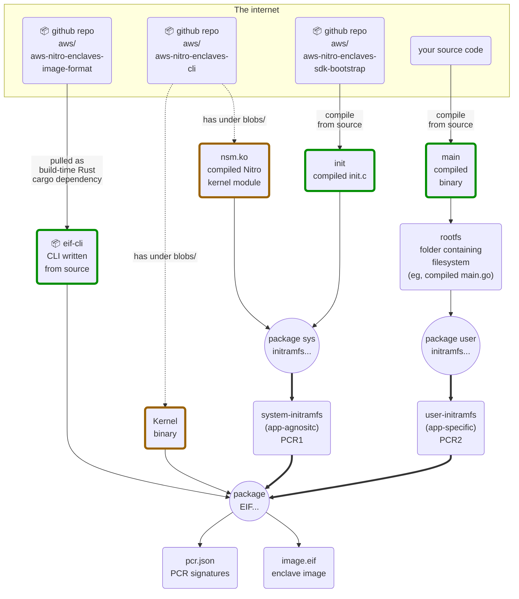

# AWS Nitro utilities

This repo contains a Nix flake with some helpers to reproducibly build AWS Nitro Enclave image files.

You can think of it as an alternative to `nitro-cli build-enclave` for building EIFs. The idea is to:
- have  a more secure EIF-building process, by having the tool that builds them also be bit-by-bit reproducible, thus reducing the surface for supply-chain attacks
- remove the dependency on containers completely, while still allowing their use
- give users complete control over their enclave images, providing additional options like BYOK (Bring Your Own Kernel)
- easily build EIFs on systems other than Amazon Linux, including M1+ Macs (e.g, it's possible to build an x86_64 Linux EIF on an ARM Mac)


The tradeoffs are:
| Feature | `nitro-cli build-enclave` | monzo/aws-nitro-util |
|---------|-----------|----------------------|
| EIF userspace input | Docker container | any filesystem, including nix packages
| EIF bootstrap input | pre-compiled kernel binary provided by AWS | Bring Your Own Kernel (but you can still choose AWS' if you choose not to compile your own kernel)
| dependencies | Docker, linuxkit fork, [aws/aws-nitro-enclaves-image-format](https://github.com/aws/aws-nitro-enclaves-image-format/) | Nix, [aws/aws-nitro-enclaves-image-format](https://github.com/aws/aws-nitro-enclaves-image-format/)
| Source-reproducible | no, uses pre-compiled blobs provided by AWS | yes, can be built entirely from source
| Bit-by-bit reproducible EIFs | no, EIFs are timestamped | yes, building the same EIF will result in the same SHA256
| cross-architecture EIFs | yes, if you provide a container for the right architecture | yes, if you provide binaries for the right architecture
| OS | [Amazon Linux](https://docs.aws.amazon.com/enclaves/latest/user/nitro-enclave-cli-install.html) unless you [compile `nitro-cli` from source](https://github.com/aws/aws-nitro-enclaves-cli/tree/main/docs) for other Linux | any Linux or MacOS with a Nix installation
| Build spec | Dockerfile + nitro-cli CLI | Nix build

## Examples


### Building an image from a package

Assuming a self-contained Nix package (like a Go binary):
```nix
```

Assuming an existing container image in a remote registry you want to make into en EIF:
```nix
```

Assuming a local directory with pre-compiled binaries:
```nix
```

## Design

monzo/aws-nitro-util is made up of a small CLI that wraps  [aws/aws-nitro-enclaves-image-format](https://github.com/aws/aws-nitro-enclaves-image-format/) (which allows building an EIF from a specific filesystem) and of Nix utilities to reproducibly build the CLI and its inputs.


